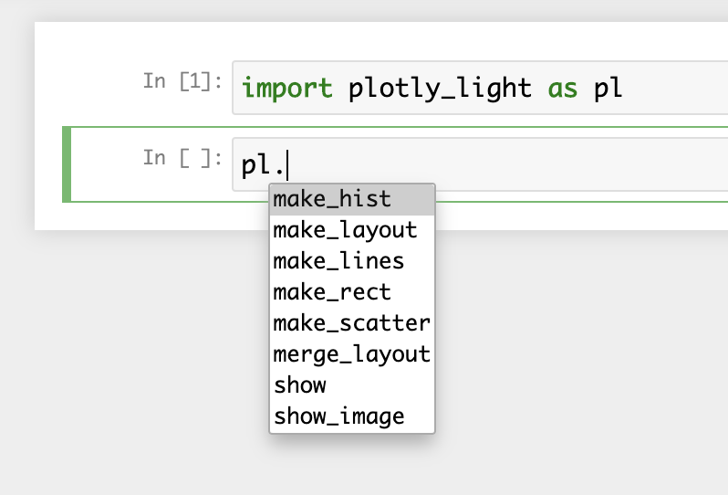
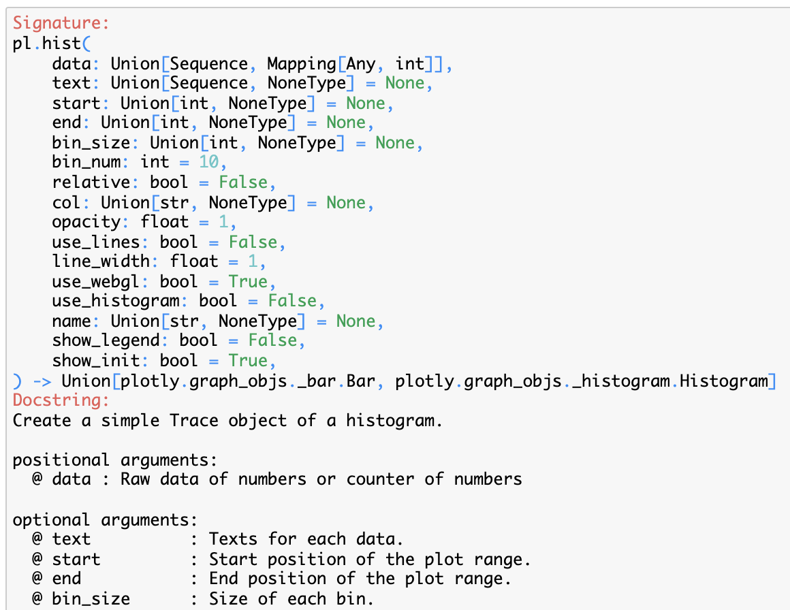

# Plotly Light

A wrapper of Plotly Python aiming for lightweight plots and ease of use.

## Requirements

- Python >= 3.7 ([CPython](https://github.com/python/cpython) is recommended)

## How to install

```bash
$ git clone https://github.com/yoshihikosuzuki/plotly_light
$ cd plotly_light
$ python setup.py install
```

## How to use (in Jupyter Notebook)

### Simple usage

```python
import plotly_light as pl

# Generate a histgram of many random numbers
# NOTE: You can confirm the file size does not increase with a very large `k`.
import random
data = random.choices(list(range(10)), k=10000)
trace = pl.make_hist(data, bin_size=1)
pl.show(trace)

# You can include the track with a custom name in the legend
trace = pl.make_hist(data, bin_size=1, name="Random", show_legend=True)
pl.show(trace)

# You can also use a custom layout
layout = pl.make_layout(x_title="Number", y_title="Frequency", x_reversed=True)
pl.show(trace, layout)
```

### Change the default theme, layout, and renderer

PLotly Light's default theme is `plotly_white`, and its default renderer is `plotly_mimetype+notebook_connected` if the code is running in Jupyter or IPython and otherwise automatically determined by Plotly.

```python
pl.set_default_theme("ggplot2")
pl.set_default_layout(your_favorite_layout_object)
pl.set_default_renderer("iframe_connected")
```

Plotly Light's default layout is defined in `src/__init__.py` as follows:

```python
set_default_layout(make_layout(font="Arial",
                               font_size_title=20,
                               font_size_axis_title=18,
                               font_size_axis_tick=15,
                               font_size_legend=15,
                               margin=dict(l=10, r=10, t=30, b=10)))
```

## List of functions

Every function/type named `XXX` offered by the package can be called as `pl.XXX`, and in Jupyter Notebook, you can see the list of available functions via completion by pressing `TAB` after typing `pl.` as follows:



Below are short descriptions of each function by their type. For details, read the docstring of each function by e.g. running `pl.XXX?` in Jupyter Notebook. Below is an example with `pl.make_hist`:



### Traces

- `make_hist`
  - Lightweight histogram using a `go.Bar` instead of `go.Histogram`.
- `make_scatter`
  - Wrapper for `go.Scatter`.
- `make_lines`
  - For line(s) especially with multiple types of widths and/or colors.
  - Can also be generated as `shapes` in `go.Layout`, although traces are more lightweight when the number of lines is large.

### Shapes

- `make_rect`
  - Utility for generating a rectangle shape object.

### Layout

- `make_layout`
  - Utility for a `go.Layout` object.

### Figure

- `make_figure`
  - Wrapper of `go.Figure`.

### Drawing a plot

- `show`
  - Wrapper of `fig.show`.
- `show_image`
  - Load and show a (zoomable by default) image file.

### Configuration (see `How to use` section above)

- `set_default_theme`
- `set_default_layout`
- `set_default_renderer`
