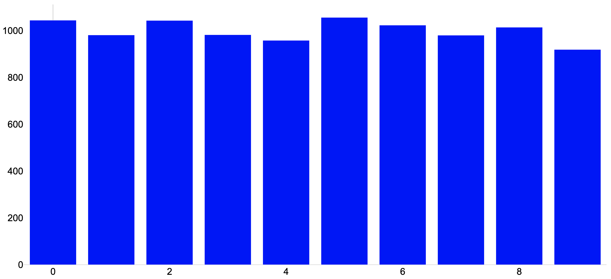
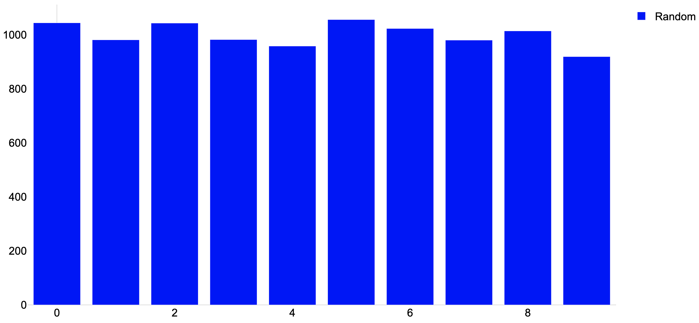
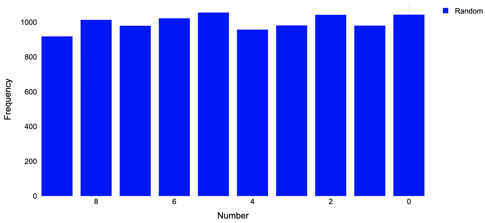

[](https://badge.fury.io/py/plotly-light)
[](LICENSE)

# Plotly Light

A wrapper of Plotly Python aiming for lightweight plots and ease of use.

## Main features

:heavy_check_mark: **[SMALLER PLOT SIZE]** Plotly Light does not keep all raw data for a bar plot including a histogram, meaning you can keep the file size of a Jupyter Notebook file or a HTML file containing the plot very small even when drawing a histogram with a huge dataset.

:heavy_check_mark: **[SEPARATE DIRECTORY FOR HTML PLOTS]** By default, each plot drawn by Plotly Light in a Jupyter Notebook is saved as a HTML file in a directory named `<notebook-basename>.iframe_figures/`, enabling us to keep the file size of a Notebook small and to easily obtain a single HTML file only of a plot. This feature can be disabled.

:heavy_check_mark: **[COMPREHENSIBLE FUNCTION ARGUMENTS]** All positional and optional arguments of the functions in Plotly Light are explicitly written (without using `*args` nor `**kwargs`), meaning you can easily find an argument you want by peeking the definition and docstring of a function (which is a feature typically provided by Jupyter Notebook and other editors).

:x: **[LIMITED FEATURES AVAILABLE]** We provide only basic plotting functions and features, meaning not everything you can do with the original Plotly can be done with Plotly Light. However, Plotly Light is usually sufficient for most of the simple purposes.

## Requirements

- Python >= 3.7 ([CPython](https://github.com/python/cpython) is recommended)
- Other required Python packages are specified in `setup.cfg` and installed automatically.

## How to install

```bash
$ git clone https://github.com/yoshihikosuzuki/plotly_light
$ cd plotly_light
$ python setup.py install
```

## How to use

The single line below imports Plotly Light (We strongly recommend the following alias just like `numpy` and `pandas`):

```python
import plotly_light as pl
```

`init_notebook_mode(connected=True)` is automatically run if imported in a Notebook.

Every function/class/type named `XXX` offered by Plotly Light can be called as `pl.XXX`, and in Jupyter Notebook, you can see the list of available functions via completion by pressing `TAB` after typing `pl.` as follows:


The list and description of arguments of a function/class can be shown by executing `pl.XXX?` in a cell. For example, `pl.hist?` will show this:


## Usage example: Drawing a simple histogram in a Jupyter Notebook

The code below draws a histgram of many random numbers. You can confirm the file sizes of both the Notebook and the plot do not increase even with a very large `k`, the number of data. With the original Plotly, the file size increases in proportion to the data size.

```python
import random
data = random.choices(list(range(10)), k=10000)
trace = pl.hist(data, bin_size=1)
pl.show(trace)
```



(**NOTE:** If running in a Jupyter Notebook, each plot is by default stored in a directory named `<notebook-basename>.iframe_figures/` as an HTML file and embedded to the Notebook with `<iframe>`. You can change this setting by selecting a differnt renderer (see the next section).)

By default, the legend is not shown. You can show it with arbitrary name of the histogram:

```python
trace = pl.hist(data, bin_size=1, name="Random", show_legend=True)
pl.show(trace)
```



You can also use a custom layout. For example, the following code sets axis labels and makes the x-axis reversed:

```python
layout = pl.layout(x_title="Number", y_title="Frequency", x_reversed=True)
pl.show(trace, layout)
```



## Changing the default layout, config, and renderer of the plots

### Layout

Plotly Light's default layout is tuned based on the original Plotly's `simple_white` theme. It is stored in the variable `pl.default.layout` as a dict:

```python
{'annotationdefaults': {'arrowhead': 0, 'arrowwidth': 1},
 'autotypenumbers': 'strict',
 'coloraxis': {'colorbar': {'outlinewidth': 1,
   'tickcolor': 'lightgray',
   'ticks': ''}},
...
```

You can update the default layout with a layout object. For example, the following code changes the default font size and margin size:

```python
pl.update_default_layout(pl.layout(font_size=40,
                                   margin=dict(l=10, r=10, t=100, b=10)))
```

Or you can permanently change the default layout by modifying the `src/default.py` file and re-installing Plotly Light.

### Config

The default config is managed in the same manner as the default layout. The `pl.default.config` variable is by default the following dict:

```python
{'showTips': False,
 'displaylogo': False,
 'modeBarButtonsToAdd': ['hoverclosest', 'hovercompare'],
 'toImageButtonOptions': {'format': 'svg'}}
```

and you can update it with a dict:

```python
pl.update_default_config({'toImageButtonOptions': {'format': 'png'}})
```

### Renderer

The renderer is automatically determined based on the environment in which Plotly Light is imported. The name of the current renderer is stored in the `pl.default.renderer` as a str. If imported in a Jupyter Notebook, then the renderer shuould be `iframe_connected` where each plot is saved as an HTML file and embedded to the Notebook with `<iframe>`. You can select a different renderer:

```python
pl.set_default_renderer("plotly_mimetype+notebook_connected")
```

The list of the availble renderers is written in the docstring of `pl.set_default_renderer`:

```text
...
positional_arguments:
  @ renderer_name : A plotly theme name like:
                     {"plotly_mimetype",
                      "browser",
                      "notebook[_connected]",
                      "iframe[_connected]"}
...
```

## List of functions

Every function `XXX` below can be called by `pl.XXX`, and `pl.XXX?` shows its docstring in Jupyter.

### Trace object

- `hist`
  - Lightweight histogram using a `go.Bar` instead of `go.Histogram`.
- `bar`
  - Wrapper for `go.Bar`.
- `scatter`
  - Wrapper for `go.Scatter`.
- `lines`
  - For line(s) especially with multiple types of widths and/or colors.
  - Can also be generated as `shapes` in `go.Layout` by specifying the `use_shape=True` argument, although traces are more lightweight when the number of lines is large.

### Shape object

- `rect`
  - Utility for generating a rectangle shape object.

### Layout object

- `layout`
  - Utility for a `go.Layout` object.
- `merge_layout`
  - Update a layout with other layouts.

### Figure object

- `figure`
  - Wrapper of `go.Figure`.

### Drawing a plot

- `show`
  - Wrapper of `fig.show`.
- `show_image`
  - Load and show a (zoomable by default) image file.

### Others

- `venn`
  - Venn diagram using `matplotlib-venn` (not a Trace nor Figure object)

### Configuration (see the previous section)

- `update_default_layout`
- `update_default_config`
- `set_default_renderer`
